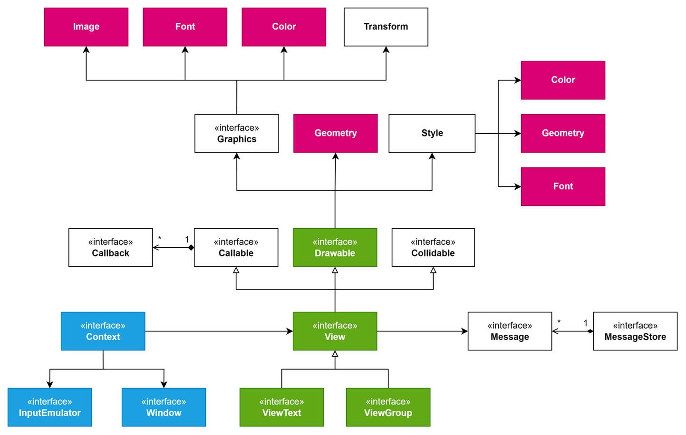

# UIa - Graphical User Interface framework for Java.
UIa is a cross-platform and cross-library framework for Java. 
It is designed to make it easy to create the graphical aspects of an application.

## Architecture overview
UIa is built on top of a native graphics library or a third-party graphical framework. 
To achieve the cross-platform goal, the UIa core has been designed to be highly adaptive.
 
Currently, its core is structured as follows:

Two interfaces are the fundamentals of UIa:
<ul>
  <li>Context: is the framework basement and has the responsibility to manage the window frame and handle a single View;</li>
  <li>View: is the basement for every widget created with UIa.</li>
</ul>

Migrating a project between two platforms is easy, all you need to do is implement the right Context 
for the target platform and use it as application basement. A desktop Context implementation, based on the Java AWT, 
has been already provided. If you have other needs, try experimenting with creating your own custom Context implementation.

## Example
The following part shows a 'hello world' application made with UIa. 
It displays a view on the left and, when the user clicks on it, a popup appears or disappears on the right. 

https://github.com/JDev00/UIa/blob/72d970c105e6114bd981ecca3fe52e0965eb4d64/src/example/HelloWorld.java