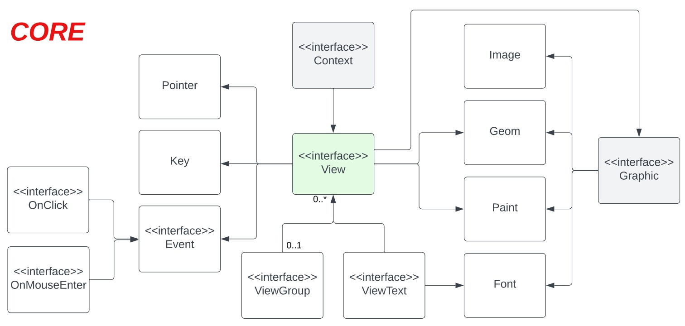

# UIa - Graphical User Interface framework for Java.
 
UIa is a cross-platform and cross-library framework for Java. It is designed to make it easy to create the graphical aspects of an application.
 
From the architectural point of view, UIa is built on top of a native graphics library or a third-party graphical framework. To achieve the cross-platform/library goal, UIa's core has been designed to be
highly adaptive.
 
At the moment, core package is structured as follows:

As you can see in the above picture, two contracts are the fundamentals of UIa:
<ul>
  <li>Context: is the framework basement and has the responsibility to show the window frame and handle a single View;</li>
  <li>View: is the basement for every widget managed and/or created with UIa.</li>
</ul>

According to its architecture, migrating a project between two platforms is easy: you need to implement the right Context for the target platform and use it as application basement.
A Desktop Context implementation, based on Java AWT, has been already provided. If you have other needs, try experimenting with creating your own custom Context implementation.
 
 
The following part shows a simple Hello World application made with UIa. It displays a button on the left and, when the user clicks on it, a simple popup appears on the right. To hide the popup, simply click on the button.

https://github.com/JDev00/UIa/blob/a6d8021d54fa1dc0406ff771508aa5c0dcd7cdc5/src/example/HelloWorld.java